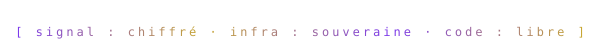

<p align="center">
  
</p>

---


Passionné d'informatique depuis mon plus jeune age, je construis des infras, je casse des trucs, et je les répare ; souvent dans cet ordre. Actuellement en B1 CS & Cybersécurité, je consacre l'essentiel de mon temps libre à mon homelab, à l'auto-hébergement souverain et à la sécurité des systèmes.

Mon crédo : **si ça tourne sur un serveur, ça devrait tourner sur le mien.**

---


#### `drwx------ infra/`

| Projet | Description | Stack |
|--------|-------------|-------|
| **[Homelab](https://github.com/LouisGue/Homelab)** | Infrastructure complète auto-hébergée ; Proxmox, Nextcloud, NPM, hardening SSH, nftables, fail2ban, AIDE, ... |    |
| **[Signal_Zero](https://github.com/LouisGue/Signal_Zero)** | Toolkit d'anonymat modulaire : chaînage Tor -> VPN, killswitch multi-niveaux, traffic shaping, namespaces réseau |    |

#### `drwxr-x--- hackathon/`

| Projet | Description | Stack |
|--------|-------------|-------|
| **[FoxyHack](https://github.com/LouisGue/FoxyHack)** | Scripts d'automatisation de déploiement Debian & recherche bastion ; 1ère place, Prix de l'Audace |      |

#### `drwxr-xr-x projets-ecole/`

| Projet | Description | Stack |
|--------|-------------|-------|
| **[GROUPIE_TRACKER_B1](https://github.com/LouisGue/GROUPIE_TRACKER_B1)** | Application web de suivi d'artistes via API musicale |   |
| **[projet-red_ASCII_Aventure](https://github.com/LouisGue/projet-red_ASCII_Aventure)** | Jeu d'aventure textuel en ASCII art |  |
| **[Power4](https://github.com/LouisGue/Power4)** | Puissance 4 jouable en ligne |    |
| **[LesDouzeCoupsd-YNOV](https://github.com/LouisGue/LesDouzeCoupsd-YNOV)** | Application web d'un jeu basé sur les douzes coups de midi (Backend + Frontend séparés) |    |
| **[Level-up-your-life](https://github.com/LouisGue/Level-up-your-life)** | App de développement personnel gamifiée |   |

---


<br/>


---


```json
{
  "portfolio": "https://www.afklab.fr",
  "association": "CyberFi - Ynov Campus Rouen"
}
```

---

<p align="center">
  
</p>
